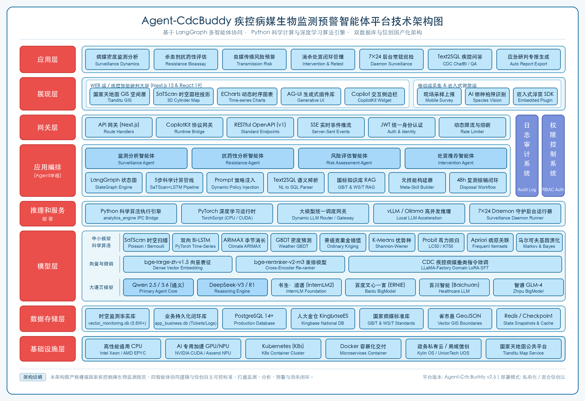

# Agent-CdcBuddy 平台技术架构设计说明

本文档全面阐述 **Agent-CdcBuddy (疾控病媒生物监测预警智能体平台)** 的系统技术架构设计，严格参照标准化分层模型，打通**“现场采集 ➔ 智能识别 ➔ 常驻守护 ➔ SaTScan 时空扫描 ➔ LSTM 深度预测 ➔ 动态预警 ➔ 处置闭环 ➔ 专报导出”**全流程。

---

## 📐 平台全景技术架构图

> **矢量图源文件**：[architecture.svg](images/architecture.svg)  
> **交互式网页查看器**：[architecture.html](images/architecture.html)  
> **高清晰度图源 (2680×1840)**：[architecture.png](images/architecture.png)

---

## 🏛️ 分层技术架构详细解析

### 1. 应用层 (Application Layer)
系统面向国家、省、市、县四级疾病预防控制中心（CDC）与爱卫办核心业务场景，封装七大核心应用能力：
- **病媒密度监测分析 (Surveillance Dynamics)**：全省 18 地市 126 区县 5.6 万+ 条捕获事实的多维度密度消长分析与优势种聚类。
- **杀虫剂抗药性评估 (Resistance Bioassay)**：基于 Probit 毒力回归测定 LC50/KT50，输出抗性等级与马尔可夫/贝叶斯基因突变阻断处方。
- **虫媒传播风险预警 (Transmission Risk)**：结合 PCR 病原筛查（登革病毒、乙脑、疟原虫等）与生境气象，量化 0~100 综合传播动力学风险指数。
- **消杀处置闭环管理 (Intervention & Retest)**：智能推荐物理/化学/生物处置方案，流转下发派工单，并跟踪 48 小时复测核销闭环。
- **7×24 后台常驻巡检 (Daemon Surveillance)**：定时与事件双轮驱动，动态注入疾控专家自然语言 Prompt Policy 策略。
- **Text2SQL 疾控问答 (CDC ChatBI / QA)**：基于 Schema 感知与参数化白名单验证的自然语言数据库智能问答。
- **应急研判专报生成 (Auto Report Export)**：一键聚合研判卡片与时空图表，自动化导出国家/省级标准 PDF / Markdown 决策公报。

---

### 2. 展现层 (Presentation Layer)
- **WEB 端 / 疾控智能研判大屏 (Next.js 15 & React 19 & Tailwind CSS)**：
  - **国家天地图 GIS 空间层**：支持宏观省域热力、区县下钻、网格密度渲染。
  - **SaTScan 时空圆柱投影**：空间经纬度与时间轴组成的三维圆柱扫描高风险聚类卡片。
  - **ECharts 动态时序图表**：双轴气温-密度关联曲线、南丁格尔玫瑰图、雷达图。
  - **AG-UI 生成式组件体系**：支持服务端动态流式直出丰富卡片与操作视图。
  - **Copilot 交互侧边栏**：基于 CopilotKit 框架的沉浸式智能体协作交互浮窗。
- **移动端采集 & 嵌入式微前端**：
  - **区县现场采样上报**：基层监测员移动端 H5 现场录入与防篡改 GPS 坐标上报。
  - **AI 物种拍照识别**：现场捕获昆虫多模态视觉分类识别与置信度评估。
  - **嵌入式浮窗 SDK**：支持作为 Widget 浮窗插件无缝嵌入外部政务/疾控业务管理系统。

---

### 3. 网关与安全治理层 (Gateway & Governance Layer)
- **API 网关 (Next.js App Router Route Handlers)**：统筹分发内部与外部业务接口请求。
- **CopilotKit 协议网关 (Runtime Bridge)**：负责前端 Copilot UI 与后端 Agent 运行时之间的双向流式协议中继。
- **RESTful OpenAPI (v1)**：向第三方生态暴露的标准开放服务接口。
- **SSE 实时事件推流 (Server-Sent Events)**：为 7×24 后台常驻巡检守护告警提供毫秒级推送管道。
- **JWT 统一身份认证**：无状态鉴权机制，保障跨端会话与 API 调用的安全性。
- **动态限流与熔断机制**：高并发防刷与大模型调用配额保护。
- **垂直支撑系统**：
  - **日志审计系统 (Audit Log)**：基于全局 `TraceId` 贯穿用户会话、Agent 状态跃迁、SQL 拦截与操作留痕。
  - **权限控制系统 (RBAC Auth)**：省级管理员、市级专家、区县监测员、公众用户四级矩阵。

---

### 4. 应用编排层 (Application & Agent Orchestration Layer - 平台中枢)
- **四智能体协同体系**：
  - **Surveillance Agent**：种群动态、ARIMA 时序、生境多样性指数与常驻巡检守护。
  - **Resistance Agent**：Probit 毒力回归、抗性矩阵雷达图、贝叶斯耐药基因演化模型。
  - **Risk Agent**：SEIR 传播动力学修正模型、Apriori 频繁项集关联规则、SaTScan 时空扫描。
  - **Intervention Agent**：关联 GB/T 23797 等国家规范，自动生成闭环处置工单。
- **核心编排能力**：
  - **LangGraph 状态图 (StateGraph)**：支持有状态的多步决策图、条件分支路由与错误自愈。
  - **SaTScan + LSTM 5 步科学级联流水线**：`数据抽取 ➔ SaTScan 扫描 ➔ K-Means 聚类 ➔ LSTM 预测 ➔ 综合研判卡片`。
  - **Prompt 策略动态注入**：支持疾控专家以自然语言下达巡检指令，热重载进入巡检引擎。
  - **Text2SQL 语义解析器**：SQL 语法树校验、白名单表视图隔离与防注入参数化执行。
  - **国标知识库 RAG**：国家标准规范库向量检索与分块增强生成。
  - **元技能构建器 (Meta-Skill Builder)**：对话式元编程，自动编译并发布自定义业务技能。
  - **48h 复测核销闭环流转**：工单派发、现场处置确认、超时督办与 48h 复测闭环逻辑。

---

### 5. 推理和服务部署层 (Inference & Service Deployment Layer)
- **Python 科学算法执行引擎 (`analytics_engine`)**：基于 Subprocess IPC 与进程间管道，无缝桥接 Node.js 与底层 Python 算法。
- **PyTorch 深度学习运行时**：支持 TorchScript 模型导出，适配 CPU 与 NVIDIA CUDA 算力环境。
- **大模型统一调度网关**：集成高可用的大模型路由、重试与负载均衡网关。
- **vLLM / Ollama 私有化高并发推理**：支持本地私有机房的高吞吐、低显存占用模型部署。
- **7×24 Daemon 守护后台运行器**：系统独立守护线程，执行常驻巡检和周期研判。

---

### 6. 模型层 (Model Layer)
- **中小模型与科学算法**：
  - Kulldorff SaTScan 空间-时间扫描统计量（Poisson / Bernoulli 模型，999次蒙特卡洛检验）
  - PyTorch 双向多变量 Bi-LSTM 深度时序预测模型
  - ARIMAX 季节时序预测（融合温湿度外生变量）
  - GBDT 气象多因子回归与贡献度排序
  - 普通克里金 (Ordinary Kriging) 空间平滑插值
  - K-Means 优势种聚类与 Shannon-Wiener 多样性指数
  - Probit 毒力回归（LC50、KT50 测定）
  - Apriori 频繁项集挖掘（病原-媒介-生境组合）
  - 马尔可夫链与贝叶斯耐药突变演化模型
- **向量与微调模型**：
  - `BAAI/bge-large-zh-v1.5`（高维语义向量表征）
  - `BAAI/bge-reranker-v2-m3`（跨语言多模态重排序）
  - CDC 疾控病媒垂类指令微调（基于 LLaMA-Factory 进行 LoRA / SFT）
- **大语言模型 (LLMs)**：
  - 通义千问系列（Qwen 2.5 / Qwen 3.6 - 核心主控 Agent）
  - DeepSeek 系列（DeepSeek-V3 / DeepSeek-R1 - 复杂推理研判引擎）
  - 书生·浦语 (InternLM2)、百度文心一言、百川智能 (Healthcare)、智谱 GLM-4 等主流模型全适配

---

### 7. 数据存储层 (Data Storage Layer)
- **时空监测事实库 (`vector_monitoring.db`)**：涵盖河南省 18 地市 5.6 万+ 条捕获事实、PCR 筛查与抗药性生物测定事实表（星型模型）。
- **业务持久化闭环库 (`app_business.db`)**：独立持久化消杀处置工单 (`biz_disposal_tickets`)、分级预警事件 (`biz_early_warning_events`)、移动端审核流 (`biz_mobile_submissions`)、生成专报归档与自定义技能。
- **PostgreSQL 14+ / 人大金仓 KingbaseES**：企业级生产库，内置 DAL 数据抽象层支持一键无缝信创迁移。
- **国家病媒标准库**：内嵌 GB/T 23797、GB/T 23798、WS/T 系列国家及行业规范标准。
- **省市县 GeoJSON 边界**：精细化河南省、地级市、区县三级矢量拓扑边界。
- **Redis / 本地状态快照**：支持 LangGraph Checkpointer 状态持久化与巡检高频缓存。

---

### 8. 基础设施层 (Infrastructure Layer)
- **计算资源**：高性能通用 CPU (Intel Xeon / AMD EPYC) 与 AI 专用加速 GPU/NPU (NVIDIA CUDA / 华为昇腾)。
- **容器与调度**：Docker 容器化微服务封装，Kubernetes (K8s) 集群管理与自动水平伸缩 (HPA)。
- **信创环境支持**：全栈适配银河麒麟 (Kylin OS) 与统信 (UnionTech UOS) 国产操作系统。
- **国家地理底图服务**：对接国家地理信息公共服务平台天地图 (Tianditu Map Service WMS/WMTS)。
