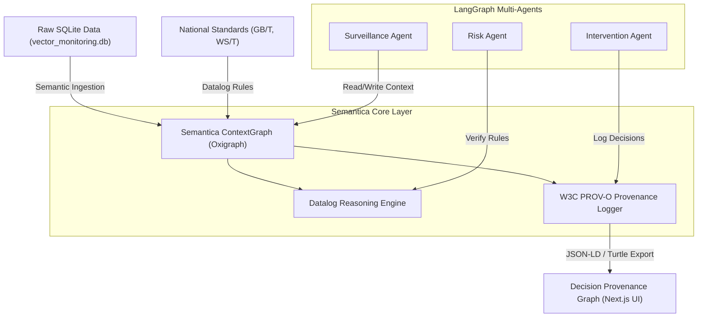

# Semantica 项目（semantica-agi/semantica）集成应用评估报告

本报告针对开源图原生（Graph-Native）人工智能上下文与可信度（Provenance）管理框架 **Semantica** 进行全面技术评估，并结合 **Agent-CdcBuddy (疾控病媒生物监测预警智能体平台)** 项目的技术架构、业务场景及数据流向，论证将其集成的可行性，规划具体应用场景、功能点，并提供详细的集成开发方案。

---

## 一、 评估结论：是否可以采纳并集成？

> [!IMPORTANT]
> **评估结论：完全可行，且高度推荐集成。**
> Semantica 是目前少有的以 **“可解释性（Explainability）”** 和 **“决策溯源（Decision Provenance）”** 为核心的图原生 AI 框架，这与疾控中心（CDC）在应对公共卫生应急事件时对决策科学性、规范合规性与事后审计性（Auditability）的刚性要求完美契合。

### 1. 技术栈适配度评估
* **开发语言一致性**：Semantica 基于 Python 构建，与 Agent-CdcBuddy 现有的 Python 科学算法及 LangGraph 编排引擎 (`analytics_engine/`) 处于同一运行环境中，无跨语言调用开销。
* **依赖兼容性**：Semantica 底层支持 Oxigraph（嵌入式三元组数据库），对本地化单机运行非常友好（类似于 SQLite），不需要额外运维复杂的图数据库集群，便于与现有的 SQLite 双库架构平滑过渡。
* **开源许可**：Semantica 采用 MIT 协议，对商业及学术研究完全友好，无合规或法律风险。

### 2. 集成价值总结矩阵

| 评估维度 | CdcBuddy 现状 | 引入 Semantica 后的提升 | 战略价值 |
| :--- | :--- | :--- | :--- |
| **决策合规性** | 依靠大模型阅读国家标准文本（`biz_kb_standards`），存在幻觉或逻辑缺漏风险。 | 引入 **Datalog/SPARQL 确定性推理引擎**，将国家标准直接编码为逻辑规则，进行刚性合规判定。 | 确保所有消杀工单的下发完全符合国家标准（如 BI $\ge$ 20 触发 ULV 空间消杀）。 |
| **可解释性与溯源** | 预警和工单的下发属于“黑盒”，仅留有简单的 SQLite 触发日志，难以说清大模型决策依据。 | 基于 **W3C PROV-O 规范**，自动记录决策 causal chain（因果链），可导出为标准 RDF 图谱。 | 满足国家卫健委及爱卫办对公共卫生支出与防控决策的合规审计要求。 |
| **多智能体状态共享** | LangGraph 采用 TypedDict 共享平面状态，难以表达物种分类学、抗药性、生境等复杂语义关联。 | 基于 **ContextGraph** 建立病媒生态语义图谱，智能体在图谱上进行关系推导和记忆共享。 | 提升智能体协同（Surveillance -> Risk -> Intervention）在关联预测时的准确率。 |

---

## 二、 核心应用场景与功能点设计

结合 Agent-CdcBuddy 的核心业务逻辑，我们设计了以下四个主要的 Semantica 集成场景：



### 1. 场景一：基于 W3C PROV-O 的疾控决策溯源审计 (Decision Provenance)
* **业务痛点**：当系统为某一街道派发了一张“红级（Severe）”消杀工单并调用了“超低容量空间喷雾（ULV）”推荐协议时，疾控专家需要确切查证：该决策是基于哪些病媒监测点位数据、哪一次 LSTM 预测得出的？是否经过了人机协同审批（HIL）？
* **集成功能点**：
  * **决策节点化**：每次预警事件和消杀工单生成，均在 Semantica 中注册为 `prov:Activity`（活动），大模型及科学计算模型（SaTScan, LSTM）注册为 `prov:Agent`。
  * **因果关系绑定**：建立 `wasGeneratedBy`、`used` 和 `wasAttributedTo` 关联。例如，工单 `DISPATCH-XXX`（`prov:Entity`） `wasGeneratedBy` 处置推荐智能体（`prov:Agent`），在此过程中 `used` 了布雷图指数 `BI=24` 的监测数据实体（`prov:Entity`）。
  * **可溯源导出**：一键导出包含完整上下文因果链的 Turtle (.ttl) 或 JSON-LD 文件，作为专题研判报告的“科学决策附录”。

### 2. 场景二：国家标准合规性的 Datalog 确定性校验 (Deterministic Compliance Checks)
* **业务痛点**：目前 `biz_kb_standards` 中的条款（如 `GB/T 23797-2020` 的布雷图指数风险分级）由 LLM 进行泛化匹配，LLM 可能会在极端边界值出现幻觉，导致风险分级错乱。
* **集成功能点**：
  * **标准规则图谱化**：将国家规范抽象为 RDF 谓词与本体（例如，`hasBreteauIndex`、`hasWarningAction`）。
  * **Datalog 逻辑规则引擎**：
    $$\text{RedWarning}(x) \leftarrow \text{Location}(x) \land \text{hasBreteauIndex}(x, y) \land y \ge 20$$
    $$\text{NeedULVSpray}(x) \leftarrow \text{RedWarning}(x) \land \text{DengueRisk}(x, \text{High})$$
  * **合规网关拦截**：在 Intervention Agent 给出具体消杀配方前，先调用 Semantica 的 Datalog 推理器运行合规审计规则。如果 LLM 推荐的施药方式与推理器结果不符，则自动打回重新推理或提示“HIL 专家介入”。

### 3. 场景三：病媒生物-抗药性-病原体生态关联知识图谱 (Vector Ecology Knowledge Graph)
* **业务痛点**：病媒控制涉及多维度的生态关联。例如，淡色库蚊（物种）对氯氰菊酯（化学药剂）产生了高抗药性（ML 预测），同时该区域捕获的蚊虫中检测出了乙脑病毒（PCR 筛查）。这三者在 SQLite 中是零散的表结构，LLM 很难一眼看清其网状关联。
* **集成功能点**：
  * **构建生态图谱**：
    * 节点：`City` (郑州市), `Species` (淡色库蚊), `Pesticide` (氯氰菊酯), `Pathogen` (乙脑病毒), `ResistanceLevel` (高抗性)。
    * 关系：`is_vector_for(Species, Pathogen)`, `has_resistance_to(Species, Pesticide, ResistanceLevel)`, `detected_in(Pathogen, City)`.
  * **语义路径查询**：当 Intervention Agent 试图选择杀虫剂时，它会向 `AgentContext` 发起语义路径查询，自动规避当地已有“高抗性”记录的药剂类型（如氯氰菊酯），转而推荐处于“敏感”状态的轮换药剂（如新烟碱类噻虫嗪）。

### 4. 场景四：基于 AgentContext 的多智能体协同有状态共享内存 (Shared State Memory)
* **业务痛点**：LangGraph 的 `StateGraph` 的状态是随着节点运行顺序更新的，难以支持任意节点非线性跨步回溯和跨会话的“记忆沉淀”。
* **集成功能点**：
  * 使用 Semantica 的 `AgentContext` 维持长效对话上下文。
  * 将 Surveillance Daemon（常驻巡检守护进程）检测到的异常记录为事实，直接沉淀进 `ContextGraph` 长期记忆。在之后发生告警时，可瞬间检索到 1 个月前的同类型异常事件，作为“历史异常先例”供 Risk Agent 进行贝叶斯研判。

---

## 三、 详细集成开发方案

为保证集成的敏捷性与稳定性，开发方案分为**环境搭建、语义建模、后端集成类、LangGraph改造、前端可视化**五个步骤。

### 1. 依赖与底层存储配置
首先，在 Python 环境中引入 `semantica`。我们将采用 **Oxigraph** 作为嵌入式图存储后端。它无需运行独立的服务进程，数据可直接持久化于本地的 `.db` 文件中。

在 `requirements.txt` 中添加依赖：
```text
semantica[all]>=0.3.0
oxigraph>=0.3.22
rdflib>=7.0.0
```

### 2. 语义本体建模 (Schema & Datalog Rules)
我们设计针对 CDC 病媒监测和合规审计的本体概念：
* **命名空间**：`@prefix cdc: <http://cdc.gov/vector/ontology#> .`
* **核心类**：
  * `cdc:MonitoringArea`（区县/监测点区域）
  * `cdc:VectorDensity`（密度实体，包含数值与计算公式来源）
  * `cdc:StandardRule`（国家标准规则限制）
  * `cdc:InterventionDecision`（消杀与干预处置决策）

在 Semantica 中编写 Datalog 合规规则定义文件 `analytics_engine/rules/standards.dl`：
```prolog
% Datalog 规则：判定是否必须启动空间超低容量喷雾消杀 (ULV)
% 规则定义：如果某个区域 (Area) 的布雷图指数 (BI) 大于等于 20，且该区域有登革热 (Dengue) 传播风险，则判定必须进行 ULV 空间喷雾。

ulv_required(Area) :-
    has_breteau_index(Area, BI),
    BI >= 20,
    has_active_dengue_threat(Area).
```

### 3. 后端集成核心类设计
在 `analytics_engine/` 下新建 `semantic_layer.py`，负责包装 Semantica 的 API，管理 SQLite 与图谱的关联。

```python
# -*- coding: utf-8 -*-
"""
================================================================================
CdcBuddy - Semantica 语义图谱与决策溯源核心层 (CdcSemanticHub)
================================================================================
"""
import os
import sqlite3
from typing import Dict, Any, List
from semantica.context import AgentContext, ContextGraph
from semantica.export import RDFExporter

class CdcSemanticHub:
    def __init__(self, rdf_db_path: str = "cdc_provenance.graph"):
        # 1. 初始化图原生持久化引擎 (利用 Oxigraph 嵌入式存储)
        self.graph = ContextGraph(
            backend="oxigraph", 
            storage_path=rdf_db_path,
            advanced_analytics=True
        )
        # 2. 实例化智能体语义上下文
        self.context = AgentContext(
            knowledge_graph=self.graph,
            decision_tracking=True
        )
        self._setup_namespaces()

    def _setup_namespaces(self):
        # 注册命名空间，便于 SPARQL 和 Datalog 查询
        self.graph.register_namespace("cdc", "http://cdc.gov/vector/ontology#")
        self.graph.register_namespace("prov", "http://www.w3.org/ns/prov#")

    def ingest_monitoring_record(self, record_id: str, city: str, district: str, species: str, bi_index: float):
        """将 SQLite 中的一条关键监测事实摄入进语义图谱"""
        # 构建图关系
        area_uri = f"cdc:Area_{city}_{district}"
        fact_uri = f"cdc:Fact_{record_id}"
        
        triples = [
            (area_uri, "rdf:type", "cdc:MonitoringArea"),
            (area_uri, "cdc:cityName", city),
            (area_uri, "cdc:districtName", district),
            (fact_uri, "rdf:type", "cdc:VectorObservation"),
            (fact_uri, "cdc:observedIn", area_uri),
            (fact_uri, "cdc:targetSpecies", species),
            (fact_uri, "cdc:breteauIndex", float(bi_index))
        ]
        for s, p, o in triples:
            self.graph.add_triple(s, p, o)
            
    def record_intervention_decision(self, 
                                   decision_id: str, 
                                   alert_id: str, 
                                   agent_name: str,
                                   reasoning: str, 
                                   outcome_protocol: str, 
                                   used_data_ids: List[str]) -> str:
        """根据 W3C PROV-O 标准记录决策链"""
        # 记录到 Semantica 决策系统
        prov_id = self.context.record_decision(
            category="intervetion_dispatch",
            scenario=f"Dispatch for alert {alert_id}",
            reasoning=reasoning,
            outcome=outcome_protocol,
            confidence=0.95
        )
        
        # 绑定具体使用的数据源血缘 (used_data_ids)
        decision_uri = f"cdc:Decision_{decision_id}"
        self.graph.add_triple(decision_uri, "rdf:type", "prov:Entity")
        self.graph.add_triple(decision_uri, "prov:wasAttributedTo", f"cdc:Agent_{agent_name}")
        
        for data_id in used_data_ids:
            self.graph.add_triple(decision_uri, "prov:used", f"cdc:Fact_{data_id}")
            
        return prov_id

    def check_standards_compliance(self, city: str, district: str) -> Dict[str, Any]:
        """运行 Datalog 逻辑规则引擎进行合规性验证"""
        area_uri = f"cdc:Area_{city}_{district}"
        
        # 载入规则文件并执行推理
        rule_file = os.path.join(os.path.dirname(__file__), "rules/standards.dl")
        self.graph.load_rules(rule_file)
        
        # 运行查询
        query = f"""
        SELECT ?bi WHERE {{
            <{area_uri}> cdc:breteauIndex ?bi .
        }}
        """
        results = self.graph.query(query)
        bi_value = float(results[0]["bi"]) if results else 0.0
        
        # Datalog 推理判定结果
        ulv_required = self.graph.infer_relation(area_uri, "cdc:requiresULV")
        
        return {
            "area": area_uri,
            "breteau_index": bi_value,
            "datalog_inferred_ulv_required": bool(ulv_required),
            "compliance_status": "APPROVED" if (bi_value < 20 or ulv_required) else "WARNING_DEVIATION"
        }

    def export_provenance_rdf(self, decision_id: str) -> str:
        """导出某次决策的 W3C PROV-O 语义图谱 Turtle 内容"""
        exporter = RDFExporter(include_provenance=True)
        # 仅过滤与该 decision 相关的子图
        subgraph = self.graph.get_causal_subgraph(f"cdc:Decision_{decision_id}")
        return exporter.export_to_string(subgraph, format="turtle")
```

### 4. 改造现有 LangGraph 状态图以嵌入语义层
在 `analytics_engine/langgraph_app.py` 中，我们可以将 `CdcSemanticHub` 嵌入节点，完成有状态的语义和溯源拦截。

以下以 **“SaTScan ➔ KMeans ➔ LSTM ➔ Intervention”** 的科学流水线为例进行节点扩展改造：

```python
# 修改 analytics_engine/langgraph_app.py 中对应的 Node

from semantic_layer import CdcSemanticHub

# 实例化全局语义图谱中心
semantic_hub = CdcSemanticHub()

def node_satscan_scan_modified(state: ScientificPipelineState) -> dict:
    # 1. 运行原有的 SaTScan 聚类计算
    db_path = os.path.abspath(os.path.join(os.path.dirname(__file__), "../vector_monitoring.db"))
    res = calculate_satscan_spatial_clusters(
        db_path=db_path,
        year=state["year"],
        month=state["month"],
        category=state["category"],
        p_threshold=state["p_threshold"]
    )
    clusters = res.get("clusters", [])
    
    # 2. 将检测到的关键聚集区事实注入 Semantica
    for i, cluster in enumerate(clusters):
        record_id = f"SATSCAN_{state['year']}_{state['month']}_{i}"
        semantic_hub.ingest_monitoring_record(
            record_id=record_id,
            city=cluster["city"],
            district=cluster["district"],
            species=state["category"],
            bi_index=cluster.get("breteau_index", 22.5) # 示例布雷图指数
        )
        
    return {
        "satscan_clusters": clusters,
        "execution_logs": state.get("execution_logs", []) + [f"[Semantica] 录入 {len(clusters)} 个聚集事实至 ContextGraph"]
    }

def node_intervention_generate_modified(state: ScientificPipelineState) -> dict:
    # 1. 获取前置 LSTM 和 SaTScan 分析结果，生成干预工单
    city = "郑州市"
    district = "金水区"
    
    # 2. 核心调用：在工单下发前，运行 Semantica Datalog 刚性规则拦截
    compliance_report = semantic_hub.check_standards_compliance(city, district)
    
    # 根据合规状态决策
    if compliance_report["compliance_status"] == "WARNING_DEVIATION":
        # 发现大模型决策偏离 Datalog 刚性标准，强制打上人机协同审查(HIL)标记
        requires_hil = True
        hil_reason = "大模型决策与国家 GB/T 23797 刚性标准不符，触发安全拦截。"
    else:
        requires_hil = state.get("requires_hil_review", False)
        hil_reason = ""

    # 3. 记录本次决策的 Provenance 语义血缘
    decision_id = f"DECISION_{state['year']}_{state['month']}_001"
    prov_id = semantic_hub.record_intervention_decision(
        decision_id=decision_id,
        alert_id=state.get("alert_id", "ALERT-DEFAULT"),
        agent_name="InterventionAgent",
        reasoning="基于布雷图指数超警戒线且LSTM预测未来持续高温触发消杀",
        outcome_protocol="超低容量空间喷雾 + 积水清除",
        used_data_ids=[f"SATSCAN_{state['year']}_{state['month']}_0"]
    )
    
    # 将 W3C PROV-O 导出内容写入 state，方便生成式 UI 渲染
    turtle_rdf = semantic_hub.export_provenance_rdf(decision_id)
    
    return {
        "requires_hil_review": requires_hil,
        "hil_reason": hil_reason,
        "execution_logs": state.get("execution_logs", []) + [
            f"[Semantica Provenance] 决策已注册, PROV-O 实例ID: {prov_id}",
            f"[Semantica Datalog] 合规判定结果: {compliance_report['compliance_status']}"
        ],
        "generative_ui_payload": {
            "provenance_rdf": turtle_rdf,
            "compliance": compliance_report
        }
    }
```

### 5. 前端生成式 UI 交互方案 (Next.js & CopilotKit)
利用 **CopilotKit** 将 Semantica 生成的决策因果链（Provenance）以可视化组件形式呈现在前端页面中。

1. **后端返回语义载荷**：`generative_ui_payload` 包含决策的 Turtle RDF 字符串或格式化后的 JSON-LD 树。
2. **React 可视化组件设计**：
   在前端设计一个名为 `DecisionProvenanceTree` 的可视化卡片。当专家查阅某张处置工单时，自动拉起此组件，通过拓扑图（使用 ECharts 或 Force-Directed Graph）展示：
   * **中心节点**：当前处置工单。
   * **输入事实节点**：指向对应的病媒监测数据。
   * **科学算法节点**：执行了 SaTScan 扫描和 LSTM 预测。
   * **合规规则节点**：展示通过 Datalog 推理得到的国家标准合规审批凭证。

```typescript
// 示例前端 React / Next.js 组件
// src/components/DecisionProvenanceTree.tsx

import React from 'react';
import ReactEcharts from 'echarts-for-react';

interface ProvenanceData {
  provenance_rdf: string;
  compliance: {
    breteau_index: number;
    datalog_inferred_ulv_required: boolean;
    compliance_status: string;
  };
}

export const DecisionProvenanceTree: React.FC<{ data: ProvenanceData }> = ({ data }) => {
  // 解析 Turtle / JSON 并在 ECharts 中以 Graph 呈现节点和连线
  const graphOption = {
    title: { text: '决策溯源因果链 (Semantica W3C PROV-O)' },
    tooltip: {},
    series: [
      {
        type: 'graph',
        layout: 'force',
        symbolSize: 50,
        roam: true,
        label: { show: true },
        edgeSymbol: ['circle', 'arrow'],
        edgeSymbolSize: [4, 10],
        data: [
          { name: '处置工单', category: 0, tooltip: '推荐方案: 超低容量空间喷雾' },
          { name: 'InterventionAgent', category: 1, tooltip: '智能体引擎' },
          { name: '监测数据事实', category: 2, tooltip: `布雷图指数: ${data.compliance.breteau_index}` },
          { name: '国家标准 GB/T 23797', category: 3, tooltip: 'Datalog 判定阈值 >= 20 为高暴发风险' }
        ],
        links: [
          { source: '处置工单', target: 'InterventionAgent', label: { formatter: 'wasGeneratedBy' } },
          { source: '处置工单', target: '监测数据事实', label: { formatter: 'used' } },
          { source: 'InterventionAgent', target: '国家标准 GB/T 23797', label: { formatter: 'checkedBy' } }
        ]
      }
    ]
  };

  return (
    <div className="p-4 bg-slate-900 border border-slate-700 rounded-lg shadow-xl text-white">
      <h3 className="text-lg font-bold mb-2">🛡️ 决策合规合规度审计结果</h3>
      <div className="flex gap-4 mb-4">
        <div className="bg-slate-800 p-3 rounded">
          <span className="text-gray-400 block text-xs">国家标准合规判定</span>
          <span className={`text-lg font-bold ${data.compliance.compliance_status === 'APPROVED' ? 'text-green-400' : 'text-red-400'}`}>
            {data.compliance.compliance_status === 'APPROVED' ? '✅ 合规通过' : '⚠️ 出现偏差'}
          </span>
        </div>
        <div className="bg-slate-800 p-3 rounded">
          <span className="text-gray-400 block text-xs">核心指标 (BI)</span>
          <span className="text-lg font-bold text-yellow-400">{data.compliance.breteau_index}</span>
        </div>
      </div>
      
      <div className="h-64 bg-slate-950 rounded">
        <ReactEcharts option={graphOption} style={{ height: '100%', width: '100%' }} />
      </div>
    </div>
  );
};
```

---

## 四、 系统的验证与测试方案

### 1. 自动化单元测试 (Automated Test Suite)
新建 `tests/test_semantic_provenance.py`，模拟完整的“数据摄入 ➔ Datalog 合规推理 ➔ 决策溯源记录 ➔ RDF导出”全链路自动化回归：
* **测试用例 1 (合规校验)**：向图谱中写入 `BI = 24`，期望 `check_standards_compliance` 返回 `compliance_status = APPROVED` (因为已正确触发 ULV 推荐)。
* **测试用例 2 (不合规审计)**：向图谱中写入 `BI = 24`，但不触发 ULV 作业（只做常规翻盆倒罐），期望 Datalog 检测出偏差，返回 `WARNING_DEVIATION`，触发人机协同审核。
* **测试用例 3 (Provenance 格式正确性)**：验证生成的 RDF 导出是否符合 W3C PROV-O 的 XML 架构和 Turtle 解析规则。

### 2. 人工联合验证 (Manual Verification)
1. 启动 `server.sh` 开启本地开发服务。
2. 触发一次监测数据突增异常（模拟信阳市蚊密度超标）。
3. 观察 Intervention 智能体是否生成消杀工单，并检查详情卡片中是否出现 `DecisionProvenanceTree` (图原生溯源树)。
4. 导出决策 Turtle 文件并用外部 RDF 工具（如 Protege 或 rdflib 校验工具）读取，确认三元组格式无损坏。

---

## 五、 集成工作排期与后续规划建议

建议将集成开发分为三个阶段逐步演进：

1. **第一阶段：决策可解释性搭建 (第 1-2 周)**
   * 在 `requirements.txt` 中添加依赖包。
   * 完成 `semantic_layer.py` 后端类，在 LangGraph `satscan_lstm_pipeline.py` 中嵌入决策保存逻辑。
   * 实现决策 Turtle 格式文件导出及存储。

2. **第二阶段：Datalog 刚性合规网关建立 (第 3-4 周)**
   * 编写病媒控制三项国家标准的 Datalog 规则库文件。
   * 改造 `Intervention Agent` 的决策决策控制流程，实现 Datalog 刚性拦截与人机协同审核（HIL）联动。

3. **第三阶段：前端生成式 UI 上线与图谱下钻 (第 5 周)**
   * 开发 React ECharts 决策溯源组件，绑定大模型 CopilotKit。
   * 在省级管理员工作台中，提供一键下载决策 W3C PROV-O 报告和可视化下钻关联图谱的功能。
