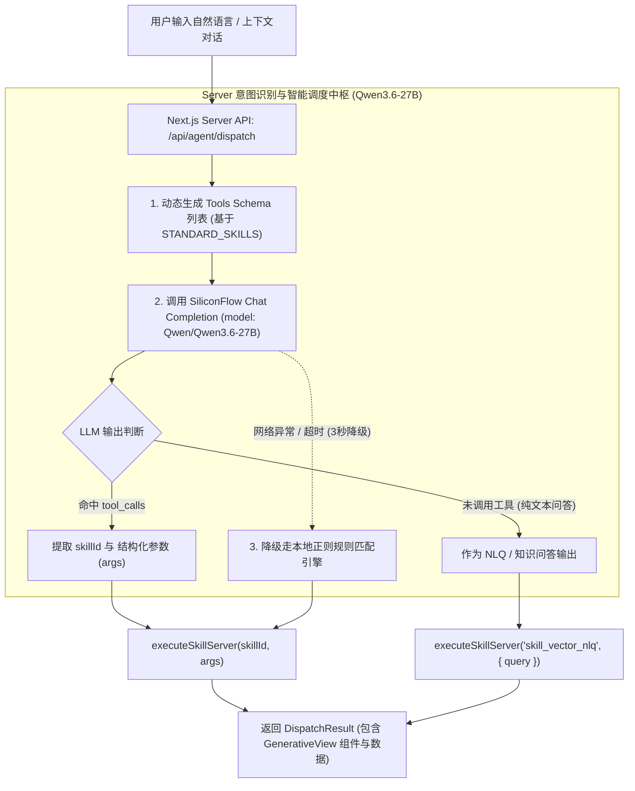

# 基于 Qwen3.6-27B (SiliconFlow) 大模型 Tool Calling 的意图识别与技能调用实施方案

## 方案背景与目标
目前系统中意图识别主要采用静态关键词与正则匹配，在遇到同义词或句式变化（例如“显示郑州市2024年8月病媒监测数据”缺少“表”字）时容易误入兜底分支。
本项目环境变量已配置 SiliconFlow 硅基流动平台的 `Qwen/Qwen3.6-27B` 模型服务 (`SILICONFLOW_API_KEY`, `SILICONFLOW_BASE_URL`, `SILICONFLOW_MODEL`)。本方案将利用该大模型的 **Function / Tool Calling** 机制，实现端到端的精准意图识别、参数槽位抽取、多轮上下文理解以及技能调度。

---

## 总体架构设计

---

## 实施步骤与改动清单

### 1. [NEW] [llm-router.ts](file:///Users/nathanzhang/Documents/DEV/AI-CDC/Agent-CdcBuddy/src/lib/skills/llm-router.ts)
**职责**：大模型 Tool Calling 路由核心模块。
- **Tools 转换器 (`getSiliconFlowSkillTools`)**：将 `STANDARD_SKILLS` 中的 15 个技能元数据和 JSON Schema 参数无缝转换为 SiliconFlow/OpenAI 标准的 `tools: [{ type: 'function', function: { name, description, parameters } }]`。
- **CDC 疾控专属系统提示词 (`CDC_ROUTER_SYSTEM_PROMPT`)**：
  - 明确各技能职责边界（尤其是明确区分：数据明细查询 `skill_monitoring_data_table`、消长预测 `skill_population_dynamics`、时空预警 `skill_spatial_early_warning`、国家标准问答 `skill_vector_nlq`、消杀工单 `skill_disposal_workflow`）。
  - 规范时间与地名参数的结构化提取格式。
- **Tool Calling 执行器 (`routeSkillWithLLM`)**：
  - 调用 `https://api.siliconflow.cn/v1/chat/completions`，传入 `tools` 与上下文 `messages`。
  - 解析模型返回的 `tool_calls[0].function`，获取 `skillId` 与解析后的 JSON 参数对象。
  - 设置 3 秒超时限制与 AbortController，确保用户界面低延迟。

### 2. [NEW] [/api/agent/dispatch/route.ts](file:///Users/nathanzhang/Documents/DEV/AI-CDC/Agent-CdcBuddy/src/app/api/agent/dispatch/route.ts)
**职责**：提供安全的服务端调度 API 端点。
- 保护 `SILICONFLOW_API_KEY` 环境变量不暴露在前端。
- 接收前端传入的 `promptText`、`chatHistory` 及用户角色上下文。
- 执行 LLM Tool Calling 路由或本地规则降级，并直接调用 `executeSkillServer` 返回渲染所需的数据包。

### 3. [MODIFY] [dispatcher.ts](file:///Users/nathanzhang/Documents/DEV/AI-CDC/Agent-CdcBuddy/src/lib/skills/dispatcher.ts)
**职责**：统一调度入口对接与容灾降级。
- 客户端 `dispatchSkillPrompt` 改为优先发起 `/api/agent/dispatch` 请求。
- 保留现有的本地规则匹配引擎作为 `fallbackRuleDispatch`，当大模型网络离线或异常时无缝兜底，保障 100% 可用性。

---

## 针对用户案例的预期效果验证

| 测试指令 | 原机制识别结果 | Qwen3.6-27B Tool Calling 识别结果 | 结构化参数提取 |
| :--- | :--- | :--- | :--- |
| **“显示郑州市2024年8月病媒监测数据”** | ❌ 误判为 `skill_vector_nlq` (知识库问答) | ✅ **`skill_monitoring_data_table`** (明细表查询) | `city: "郑州市"`, `year: 2024`, `month: 8` |
| **“显示郑州市2024年8月全部病媒监测数据表”** | ✅ `skill_monitoring_data_table` | ✅ **`skill_monitoring_data_table`** (明细表查询) | `city: "郑州市"`, `year: 2024`, `month: 8` |
| **“评估淡色库蚊对氯氰菊酯的抗药性”** | ✅ `skill_resistance_evaluation` | ✅ **`skill_resistance_evaluation`** (抗药性评估) | `speciesName: "淡色库蚊"`, `pesticideName: "氯氰菊酯"` |
| **“国家标准中蚊虫诱捕灯布设高度是多少米？”** | ✅ `skill_vector_nlq` | ✅ **`skill_vector_nlq`** (CDC 规范问答) | `query: "国家标准中蚊虫诱捕灯布设高度是多少米？"` |

---

## 验证计划

### 1. 自动化集成测试
- 编写测试脚本 `scripts/test_llm_tool_calling.ts`，批量发送 10 组典型疾控业务提问（包括模糊查询、相对时间、多轮代词指代），验证 Qwen3.6-27B 的 Tool Calling 命中率与参数正确率。

### 2. 界面与人机协同交互验证
- 在 Web 前端协同研判对话框中输入“显示郑州市2024年8月病媒监测数据”，验证是否精准调用 **【病媒监测明细数据表查询 (Text2SQL)】** 并在主工作区生成交互式数据表格。
- 断网/超时模拟：测试极端异常情况下自动平滑降级到规则引擎的稳定性。
