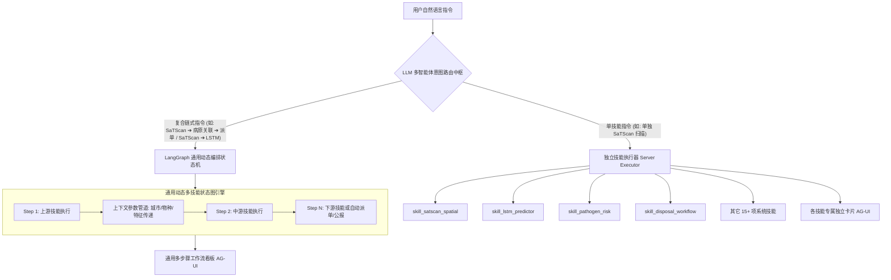

# 基于 LangGraph 的通用可编排多技能协同体系与算法解耦实施方案

## 1. 现状剖析与升级目标

### 现状痛点
1. **强绑定与孤岛化**：此前将 SaTScan、K-Means 与 LSTM 固化为单一闭环脚本，无法单独调用单个算法（如仅做 SaTScan 地图扫描或仅做 LSTM 预测）。
2. **缺乏跨技能通用编排能力**：用户不仅需要单独使用各算法，还期望能**将 SaTScan / LSTM 与系统内其他各类技能（如病原关联分析、抗药性评估、传播动力学、消杀派单、专题公报生成等）自由组合与链式串联**。

### 升级目标
1. **全量技能原子化解耦 (Atomic Skill Decoupling)**：
   - 将 SaTScan（`skill_satscan_spatial`）、LSTM（`skill_lstm_predictor`）、K-Means（`skill_kmeans_subgroups`）与现有 15 项标准技能一样，作为**独立的一等公民技能**注册并支持单独调用。
   - 每个技能配备独立的 Python 真实计算引擎与专属的 AG-UI 独立视图卡片。
2. **构建通用 LangGraph 多技能动态编排工作流引擎 (Generic Composable Workflow Engine)**：
   - 建立通用的 `ComposableSkillGraph` 状态图机制，支持系统内**任意 $N$ 个 Skill** 的动态链式编排（例如：`SaTScan 扫描` ➔ `病原 PCR 关联分析` ➔ `消杀应急派单`；或 `种群消长` ➔ `抗药性演化` ➔ `专题公报导出`）；
   - 提供通用跨技能上下文数据管道（Context Pipeline），上游技能输出的高危城市/物种/特征可无缝传递给下游技能作为输入参数。
3. **动态流水线前端渲染器 ([ComposableWorkflowCard.tsx](file:///Users/nathanzhang/Documents/DEV/AI-CDC/Agent-CdcBuddy/src/components/ag-ui/ComposableWorkflowCard.tsx))**：
   - 动态感知任意步骤拓扑，渲染通用的 LangGraph 步骤进度条、各步骤独立卡片预览与人机协同审核断点。
4. **智能多技能路由识别器 ([llm-router.ts](file:///Users/nathanzhang/Documents/DEV/AI-CDC/Agent-CdcBuddy/src/lib/skills/llm-router.ts))**：
   - 单意图指令 ➔ 精准路由到单个独立技能；
   - 复合链式指令 ➔ 智能解析技能调用链（Skill Pipeline Chain），编译为动态 LangGraph 并发/串行流转。

---

## 2. 系统全景架构设计



---

## 3. 详细实施清单

### 一、 技能解耦与独立原子技能注册
1. **[MODIFY] [registry.ts](file:///Users/nathanzhang/Documents/DEV/AI-CDC/Agent-CdcBuddy/src/lib/skills/registry.ts)**：
   - 新增独立技能 **`skill_satscan_spatial`**（SaTScan 空间泊松时空扫描与聚集热点）
   - 新增独立技能 **`skill_lstm_predictor`**（LSTM 深度时序外推预测与置信区间）
   - 新增独立技能 **`skill_kmeans_subgroups`**（K-Means 多维生态特征画像聚类）
   - 新增通用复合编排技能 **`skill_composable_workflow`**（任意多技能动态编排流水线）
   - 保留原 `skill_satscan_kmeans_lstm` 预置快捷流水线与 `skill_daemon_surveillance`
2. **[MODIFY] [llm-router.ts](file:///Users/nathanzhang/Documents/DEV/AI-CDC/Agent-CdcBuddy/src/lib/skills/llm-router.ts) & [dispatcher.ts](file:///Users/nathanzhang/Documents/DEV/AI-CDC/Agent-CdcBuddy/src/lib/skills/dispatcher.ts)**：
   - **单技能精确拦截**：
     - 若指令仅包含 *“使用 SaTScan 分析...并显示在地图上”* ➔ 路由到 `skill_satscan_spatial`；
     - 若指令仅包含 *“使用 LSTM 预测...未来一周走势”* ➔ 路由到 `skill_lstm_predictor`；
     - 若指令仅包含 *“K-Means 特征分群”* ➔ 路由到 `skill_kmeans_subgroups`；
   - **通用复合流水线动态识别**：
     - 识别多步骤连接词（如 `先...再...然后...`、`调用...并将...导入...`、`➔`、`->`）；
     - 动态提取涉及的 Skill 列表与执行次序，生成动态工作流定义。

---

### 二、 Python 算法引擎与通用 LangGraph 编排层
1. **[NEW] [analytics_engine/composable_workflow.py](file:///Users/nathanzhang/Documents/DEV/AI-CDC/Agent-CdcBuddy/analytics_engine/composable_workflow.py)**：
   - 核心构建通用的 `ComposableSkillGraph`：
     ```python
     class ComposableWorkflowState(TypedDict):
         pipeline_steps: List[Dict[str, Any]] # 技能步骤清单
         shared_context: Dict[str, Any]       # 跨步骤共享上下文(城市、区县、风险物种等)
         step_results: Dict[str, Any]         # 各步骤计算输出
         execution_logs: List[str]            # DAG 全局流转日志
         requires_hil: bool                   # 人机协同断点标志
         final_output: Dict[str, Any]
     ```
   - 动态将任意注册的 Python 算法节点（SaTScan, LSTM, ARIMA, GBDT, K-Means, Apriori, 贝叶斯等）挂载为 LangGraph 节点，实现按需编译与数据流贯通。
2. **[MODIFY] [analytics_engine/engine.py](file:///Users/nathanzhang/Documents/DEV/AI-CDC/Agent-CdcBuddy/analytics_engine/engine.py)**：
   - 注册 `satscan_spatial`、`lstm_predictor`、`species_clustering` 独立任务与 `composable_workflow` 动态编排任务。
3. **[MODIFY] [server-executor.ts](file:///Users/nathanzhang/Documents/DEV/AI-CDC/Agent-CdcBuddy/src/lib/skills/server-executor.ts)**：
   - 增加对独立技能与通用工作流的服务端执行路由。

---

### 三、 前端 AG-UI 生成式组件体系升级
1. **[NEW] [SatScanSpatialCard.tsx](file:///Users/nathanzhang/Documents/DEV/AI-CDC/Agent-CdcBuddy/src/components/ag-ui/SatScanSpatialCard.tsx)**：
   - 纯粹的 SaTScan 空间研判卡片，包含全屏 GIS 地图、扫描圆环、LLR/RR 统计卡、显著性检验表与消杀防制指引，支持深浅双色模式。
2. **[NEW] [LSTMPredictorCard.tsx](file:///Users/nathanzhang/Documents/DEV/AI-CDC/Agent-CdcBuddy/src/components/ag-ui/LSTMPredictorCard.tsx)**：
   - 专属的 LSTM 深度时序预测卡片，展示 95% 带状置信区间扩散图、多地市快速切换、突增峰值告警与专家研判要点。
3. **[NEW] [ComposableWorkflowCard.tsx](file:///Users/nathanzhang/Documents/DEV/AI-CDC/Agent-CdcBuddy/src/components/ag-ui/ComposableWorkflowCard.tsx)**：
   - 通用多技能工作流看板，能自适应展示任意 $N$ 个 Skill 的执行进度拓扑、各步骤折叠/展开视图、数据管道流转与统一 HIL 审查。
4. **[MODIFY] [GenerativeComponentRenderer.tsx](file:///Users/nathanzhang/Documents/DEV/AI-CDC/Agent-CdcBuddy/src/components/ag-ui/GenerativeComponentRenderer.tsx)**：
   - 统一挂载所有独立卡片与通用工作流看板。

---

## 4. 验证用例与验收标准

| 测试场景 | 测试输入示例 | 预期行为与产物 |
| :--- | :--- | :--- |
| **场景 1：单独调用 SaTScan** | `使用 SaTScan 分析2022年6月全省的蚊媒密度分布并显示在地图上` | 路由到 `skill_satscan_spatial`，生成纯 `SatScanSpatialCard`，在 GIS 上展示扫描结果，无 LSTM/K-Means |
| **场景 2：单独调用 LSTM** | `使用 LSTM 预测信阳市和郑州市未来一周的蚊类密度趋势` | 路由到 `skill_lstm_predictor`，生成纯 `LSTMPredictorCard`，展示 7 天置信带预测 |
| **场景 3：跨技能任意组合 (SaTScan ➔ 病原 ➔ 派单)** | `调用 SaTScan 扫描高危聚集区，结合病原检测评估传播风险，并自动生成消杀处置工单` | 动态编译 3 节点 LangGraph，生成 `ComposableWorkflowCard`，上游高危城市数据贯通至病原与派单 |
| **场景 4：经典 3 步流水线** | `调用 SaTScan 分析2022年3月全省数据，并将高风险区域导入 LSTM 进行下一周趋势预测` | 路由至多步流水线，完整执行 SaTScan ➔ K-Means ➔ LSTM 状态机 |
| **场景 5：全量自动化回归测试** | `python3 tests/automated_test_suite.py` | 扩展至 20 项业务用例，100% 全部通过 |

---

## 5. 用户确认项

- [x] 原子算法全面解耦（SaTScan / LSTM / K-Means 可完全独立使用）
- [x] 开放架构支持与系统内任意 Skill 结合串联编排
- [x] 全链路 100% 纯真实计算与真实数据库读写
