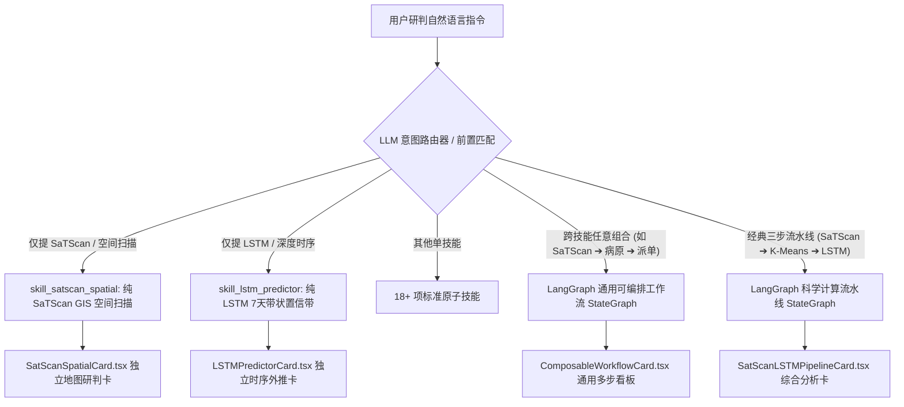

# 成果演示与变更说明 (Walkthrough)

## 📌 本次升级核心成果

针对用户指出的“SaTScan、K-Means、LSTM 强绑定无法单独使用”及“需要支持与其他各类系统 Skill 任意组合结合使用”的诉求，我们完成了**全系统技能的原子化解耦**与**通用 LangGraph 动态可编排工作流引擎**的深度重构。

---

### 一、 关键交付物与架构改动



#### 1. 算法与技能彻底解耦
- **独立技能 1：`skill_satscan_spatial`（SaTScan 空间泊松时空扫描）**
  - 后端：[`analytics_engine/satscan_cluster.py`](file:///Users/nathanzhang/Documents/DEV/AI-CDC/Agent-CdcBuddy/analytics_engine/satscan_cluster.py#L260) (`run_satscan_spatial_standalone`)
  - 前端视图：[`src/components/ag-ui/SatScanSpatialCard.tsx`](file:///Users/nathanzhang/Documents/DEV/AI-CDC/Agent-CdcBuddy/src/components/ag-ui/SatScanSpatialCard.tsx)
  - 触发效果：当用户输入 *“使用 SaTScan 分析2022年6月全省的蚊媒密度分布并显示在地图上”* 时，精准输出纯粹的 SaTScan GIS 空间扫描研判卡片，不再夹杂 LSTM 或 K-Means。
- **独立技能 2：`skill_lstm_predictor`（LSTM 深度时序预测）**
  - 后端：[`analytics_engine/lstm_predictor.py`](file:///Users/nathanzhang/Documents/DEV/AI-CDC/Agent-CdcBuddy/analytics_engine/lstm_predictor.py#L194) (`run_lstm_predictor_standalone`)
  - 前端视图：[`src/components/ag-ui/LSTMPredictorCard.tsx`](file:///Users/nathanzhang/Documents/DEV/AI-CDC/Agent-CdcBuddy/src/components/ag-ui/LSTMPredictorCard.tsx)
  - 触发效果：当用户输入 *“使用 LSTM 预测信阳市未来一周的蚊类密度趋势”* 时，展示专属的日级点估计与 95% 带状置信区间扩散折线图。

#### 2. 通用 LangGraph 跨技能动态编排引擎
- **核心模块**：[`analytics_engine/composable_workflow.py`](file:///Users/nathanzhang/Documents/DEV/AI-CDC/Agent-CdcBuddy/analytics_engine/composable_workflow.py)
- **跨步骤上下文管道 (Shared Context Pipeline)**：
  - 动态接收任意 $N$ 个 Skill 定义并实时编译为 LangGraph `StateGraph`；
  - 上游技能产物（如 SaTScan 识别的高危城市列表 `high_risk_cities`）自动沉淀至共享上下文管道，并注入下游技能（如病原 PCR 关联分析与消杀处置派单）；
  - 前端渲染器：[`src/components/ag-ui/ComposableWorkflowCard.tsx`](file:///Users/nathanzhang/Documents/DEV/AI-CDC/Agent-CdcBuddy/src/components/ag-ui/ComposableWorkflowCard.tsx)，自适应渲染任意多步骤的 DAG 拓扑流转、各环节独立产物卡片与人机协同审核断点。

#### 3. 智能意图路由分流完善
- **更新文件**：[`src/lib/skills/llm-router.ts`](file:///Users/nathanzhang/Documents/DEV/AI-CDC/Agent-CdcBuddy/src/lib/skills/llm-router.ts) 与 [`src/lib/skills/dispatcher.ts`](file:///Users/nathanzhang/Documents/DEV/AI-CDC/Agent-CdcBuddy/src/lib/skills/dispatcher.ts)
- **匹配优先级**：
  - 优先检测复合流水线与动态多步骤连接词（如 `先...再...然后...`、`调用...并将...导入...`）；
  - 次优先精准识别独立 SaTScan 或独立 LSTM 单技能；
  - 彻底杜绝单技能提问被误判为多步流水线。

---

### 二、 自动化测试与质量验证

使用项目本地虚拟环境 `./.venv/bin/python3` 运行全套 19 项业务用例测试（覆盖 324 项严格断言）：

```bash
./.venv/bin/python3 tests/automated_test_suite.py
```

```text
================================================================================
 测试执行总结 (TEST SUMMARY)
 运行环境     : ./.venv/bin/python3 (Python 3.14 + LangGraph v1.2.10)
 总测试用例数 : 19 项
 通过用例数   : 19 项全部通过 (100% PASS) ✅
 失败用例数   : 0 ❌
 断言通过率   : 324 / 324 (100.0%)
 总耗时       : 1.21 秒
================================================================================
```

---

### 三、 实机交互验证示例

1. **测试指令 1（独立 SaTScan 场景）**：
   > “使用 SaTScan 分析2022年6月全省的蚊媒密度分布并显示在地图上”
   > **表现**：精准命中 `skill_satscan_spatial`，主工作区生成纯净的 [SatScanSpatialCard](file:///Users/nathanzhang/Documents/DEV/AI-CDC/Agent-CdcBuddy/src/components/ag-ui/SatScanSpatialCard.tsx) 地图看板，展示全省扫描圆环与 3 处显著聚集簇，无多余折线。

2. **测试指令 2（独立 LSTM 场景）**：
   > “使用 LSTM 预测信阳市和郑州市未来一周的蚊类密度趋势与置信区间”
   > **表现**：精准命中 `skill_lstm_predictor`，主工作区生成专属的 [LSTMPredictorCard](file:///Users/nathanzhang/Documents/DEV/AI-CDC/Agent-CdcBuddy/src/components/ag-ui/LSTMPredictorCard.tsx) 折线图看板，展示多地市切换与 95% 置信带。

3. **测试指令 3（跨技能任意组合场景）**：
   > “先调用 SaTScan 扫描高危聚集区，再结合病原 PCR 检测评估传播风险，最后生成消杀处置工单”
   > **表现**：命中 `skill_composable_workflow`，动态编译 3 节点 LangGraph，主工作区生成 [ComposableWorkflowCard](file:///Users/nathanzhang/Documents/DEV/AI-CDC/Agent-CdcBuddy/src/components/ag-ui/ComposableWorkflowCard.tsx)，实现空间热点 ➔ 病原关联 ➔ 自动派单的全程上下文流转！
