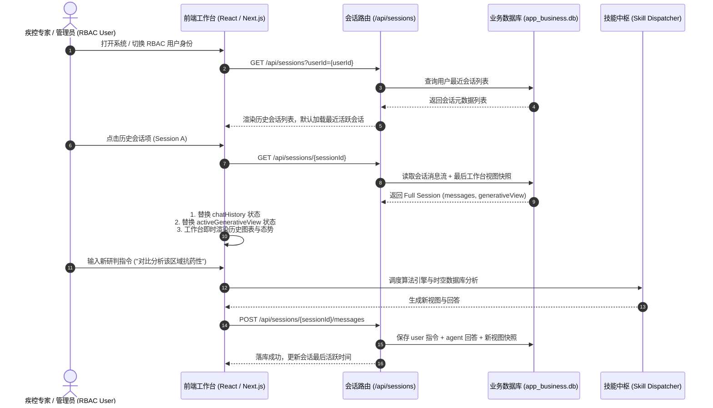

# 按用户记录历史会话、历史会话查询与重新加载功能设计方案

## 1. 方案背景与目标

当前 CdcBuddy 疾控病媒生物监测预警智能体的前端聊天记录（`chatHistory`）和工作台视图（`activeGenerativeView`）仅保存在 React 组件的内存状态中，刷新页面或切换 RBAC 角色时上下文会丢失，无法追溯历史研判过程。

为满足疾控业务人员对**多课题连续研判**、**历史处置追踪**和**多角色独立会话隔离**的需求，本方案设计一套**轻量级、高可靠、无缝恢复**的会话持久化与重载体系，支持：
1. **多用户会话隔离与持久化存储**：按照 RBAC `userId` 分离存储会话与消息历史；
2. **多维度历史会话检索与管理**：支持分页查询、关键词检索、置顶标记、重命名与删除；
3. **会话全状态重新加载（Full State Reload & Resume）**：一键恢复对话上下文及当时工作台渲染的 AG-UI 动态生成式视图（地图、ECharts、工单、研判报告）；
4. **无缝对话延续**：重载后支持在原会话中继续对话并实时落库。

---

## 2. 系统架构与数据流图



---

## 3. 数据模型设计 (Database Schema & TypeScript Types)

在 `app_business.db`（SQLite，兼容 PostgreSQL / KingbaseES）中新增 2 张核心业务表：

### 3.1 `biz_chat_sessions` 会话主表

| 字段名 | 类型 | 约束 | 描述 |
| :--- | :--- | :--- | :--- |
| `session_id` | VARCHAR(64) | PRIMARY KEY | 会话唯一标识 (如 `sess_20260809_xxx`) |
| `user_id` | VARCHAR(64) | NOT NULL, INDEX | 所属 RBAC 用户 ID (如 `user-001`) |
| `user_name` | VARCHAR(64) | NOT NULL | 所属用户姓名 (如 `张主任`) |
| `user_role` | VARCHAR(64) | NOT NULL | 用户角色 (`PROVINCIAL_ADMIN` 等) |
| `title` | VARCHAR(256) | NOT NULL | 会话标题 (首条提问提炼或自定义修改) |
| `last_generative_view` | TEXT | NULL | 最近一次工作台视图的完整 JSON 快照 |
| `message_count` | INTEGER | DEFAULT 0 | 包含的消息总数 |
| `is_pinned` | BOOLEAN | DEFAULT 0 | 是否置顶 (1: 是, 0: 否) |
| `created_at` | DATETIME | NOT NULL | 会话创建时间 |
| `updated_at` | DATETIME | NOT NULL, INDEX | 最后更新/对话时间 |

> **索引规划**：`CREATE INDEX idx_sessions_user_updated ON biz_chat_sessions(user_id, is_pinned DESC, updated_at DESC);`

### 3.2 `biz_chat_messages` 消息明细表

| 字段名 | 类型 | 约束 | 描述 |
| :--- | :--- | :--- | :--- |
| `message_id` | VARCHAR(64) | PRIMARY KEY | 消息唯一 ID (如 `msg_xxx`) |
| `session_id` | VARCHAR(64) | NOT NULL, INDEX | 所属会话 ID (外键关联) |
| `sender` | VARCHAR(16) | NOT NULL | 发送者角色 (`user` / `agent` / `system`) |
| `text` | TEXT | NOT NULL | 消息 Markdown 正文 |
| `skill_used` | VARCHAR(64) | NULL | 智能体调用的技能名称/标识 |
| `generative_view_snapshot` | TEXT | NULL | 本条指令触发的生成式视图 JSON 快照 |
| `timestamp` | VARCHAR(32) | NOT NULL | 格式化时间戳 (如 `11:45`) |
| `created_at` | DATETIME | NOT NULL | 消息入库时间 |

---

## 4. 后端 API 接口设计

### 4.1 会话管理接口 (`/api/sessions`)

- **`GET /api/sessions?userId={userId}&keyword={keyword}&page=1&pageSize=20`**
  - **功能**：获取指定用户的历史会话列表。
  - **响应**：
    ```json
    {
      "code": 0,
      "data": {
        "total": 12,
        "sessions": [
          {
            "sessionId": "sess_1001",
            "title": "郑州金水区伊蚊密度暴发专项研判",
            "messageCount": 6,
            "isPinned": true,
            "lastGenerativeViewType": "SPATIAL_EARLY_WARNING_MAP",
            "updatedAt": "2026-08-09 11:30:00",
            "createdAt": "2026-08-09 10:15:00"
          }
        ]
      }
    }
    ```

- **`POST /api/sessions`**
  - **功能**：创建新会话。
  - **入参**：`{ "userId": "user-001", "userName": "张主任", "userRole": "PROVINCIAL_ADMIN", "title": "新研判会话" }`
  - **响应**：返回新创建的 `sessionId` 与初始信息。

- **`GET /api/sessions/{sessionId}`**
  - **功能**：查询单条会话详情（包含全部消息流与最新视图快照，用于重新加载）。
  - **响应**：
    ```json
    {
      "code": 0,
      "data": {
        "sessionId": "sess_1001",
        "title": "郑州金水区伊蚊密度暴发专项研判",
        "lastGenerativeView": { "type": "SPATIAL_EARLY_WARNING_MAP", ... },
        "messages": [
          {
            "id": "msg_1",
            "sender": "user",
            "text": "分析金水区伊蚊密度超标情况",
            "timestamp": "11:20"
          },
          {
            "id": "msg_2",
            "sender": "agent",
            "text": "已调取郑州市金水区时空监测数据...",
            "skillUsed": "时空预警地图",
            "timestamp": "11:21"
          }
        ]
      }
    }
    ```

- **`POST /api/sessions/{sessionId}/messages`**
  - **功能**：向会话中批量或单条追加消息，并更新会话快照与时间。
  - **入参**：`{ "messages": [...], "generativeView": { ... } }`

- **`PATCH /api/sessions/{sessionId}`**
  - **功能**：修改会话标题、置顶状态。
  - **入参**：`{ "title"?: "...", "isPinned"?: true }`

- **`DELETE /api/sessions/{sessionId}`**
  - **功能**：删除指定历史会话及关联消息。

- **`DELETE /api/sessions?userId={userId}&action=clearAll`**
  - **功能**：一键清空该用户的所有历史会话。

---

## 5. 前端交互与视图重载设计

### 5.1 界面布局与组件交互增强

1. **右侧对话区 Header 升级**：
   - 顶部增加**会话状态栏**：
     - 当前会话标题展示（支持内联双击重命名 ✏️）。
     - **新建对话按钮 (➕)**：一键开启新会话，重置工作台与聊天流。
     - **历史会话入口 (🕒 历史记录)**：支持抽屉侧滑展开或下拉浮层。
2. **历史会话抽屉（Session History Drawer）**：
   - **时间分段聚合**：按“今天”、“昨天”、“近7天”、“更早”清晰分段展示。
   - **快速检索与过滤**：顶部提供输入框，实时按关键词筛选会话。
   - **快捷操作菜单**：每个会话项悬浮显示快捷操作：
     - 📌 置顶 / 取消置顶
     - ✏️ 重命名标题
     - 🗑️ 删除此会话
3. **重新加载（Reload / Resume）动效与状态恢复**：
   - 用户在列表中点击任一历史会话：
     - 右侧对话区无缝切换为该会话的历史对话流；
     - 左侧 AG-UI 动态生成式工作台瞬间还原历史图表、地图或报告快照；
     - 底部输入框自动绑定该会话，后续输入将直接在此会话上继续追加并落库。
4. **RBAC 角色切换自动联动**：
   - 在顶部 Navbar 切换用户（例如从“张主任”切换到“李研究员”）：
     - 触发用户上下文变更；
     - 自动拉取李研究员的历史会话列表；
     - 自动激活其最近一条活跃会话（若无则新建）。

---

## 6. 变更影响与安全性

- **多用户数据隔离**：所有 SQL 查询强制携带 `user_id` 过滤，确保各层级角色只能查看与管理属于自己的研判记录。
- **向下兼容**：若数据库中尚无历史会话记录（如新用户首次访问），前端平滑降级为默认初始欢迎消息与初始地图，并自动在发送第一条指令时创建首个持久化会话。
- **性能与存储优化**：`generative_view` 快照经结构化存储，体积通常在 2KB~50KB 之间，SQLite / PostgreSQL 均可轻松支持上万次会话毫秒级重载。

---

## 7. 实施计划 (Implementation Steps)

1. **数据库层**：在 `src/lib/db/app-business-provider.ts` 与 `src/lib/db/types.ts` 中新增会话与消息实体定义，添加 SQLite 建表与 CRUD 方法。
2. **服务端 API**：创建 `src/app/api/sessions/route.ts` 与 `src/app/api/sessions/[id]/route.ts` 路由。
3. **前端状态与组件**：
   - 编写 `SessionHistoryDrawer.tsx` 历史会话抽屉组件；
   - 改造 `src/app/page.tsx`，将聊天与视图状态绑定至 `currentSessionId`，实现自动保存、历史查询、会话重载与新建会话。
4. **验证与回归测试**：
   - 验证新建会话、发送指令自动落库；
   - 验证历史会话列表查询、重命名、置顶、删除；
   - 验证点击历史会话后，右侧聊天流与左侧 AG-UI 视图同步完整重载；
   - 验证切换 RBAC 用户身份时会话严格按用户隔离。
