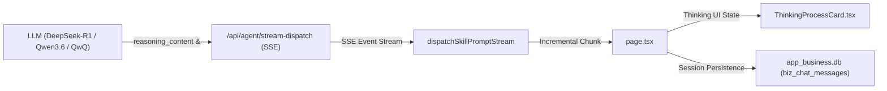

# Walkthrough - LLM 动态推理 (Thinking) 过程流式显示与交互改造

已为 **Agent-CdcBuddy** 成功实现了大模型深度思考与推理过程（Thinking / Reasoning Process）的端到端流式显示、打字机动效、实时耗时秒表与思维链交互折叠组件。

---

## 一、本次实施的改动汇总

### 1. 服务端流式端点与协议适配 (SSE Stream Engine)
- **新建文件**：[`src/app/api/agent/stream-dispatch/route.ts`](file:///Users/nathanzhang/Documents/DEV/AI-CDC/Agent-CdcBuddy/src/app/api/agent/stream-dispatch/route.ts)
  - 实现基于 Server-Sent Events (SSE) 的流式接口，兼容 SiliconFlow / DeepSeek-R1 / Qwen3.6 的 `delta.reasoning_content` 以及开源模型的 `<think>...</think>` 标签流式分流。
  - 支持智能体 Tool Calling 的两阶段调度：阶段一输出思考流与工具决策，阶段二在服务端执行 Python/SQL 工具后，流式生成数据归纳与研判结论。
  - 实时分发 `reasoning_start`、`reasoning_chunk`、`reasoning_end`、`tool_call_start`、`generative_view`、`content_chunk`、`finish` 事件。

### 2. 前端思维链展示组件 (UI Components)
- **新建文件**：[`src/components/common/ThinkingProcessCard.tsx`](file:///Users/nathanzhang/Documents/DEV/AI-CDC/Agent-CdcBuddy/src/components/common/ThinkingProcessCard.tsx)
  - **思考中**：神经元图标呼吸动效、实时秒表计时器（如 `3.4s`）、等宽字体终端卡片及闪烁打字光标。
  - **思考完毕**：平滑自动折叠为胶囊卡片（「🧠 已完成深度推演思考 (耗时 3.2s)」），支持点击展开/收起完整思维链，支持一键复制推导演变过程。

### 3. 客户端流式调度引擎
- **修改文件**：[`src/lib/skills/dispatcher.ts`](file:///Users/nathanzhang/Documents/DEV/AI-CDC/Agent-CdcBuddy/src/lib/skills/dispatcher.ts)
  - 新增 `dispatchSkillPromptStream`，实现对 SSE 响应流的增量解析与事件回调驱动，同时保留原非流式方法作为自动降级兜底。

### 4. 主工作区与 Chat 渲染集成
- **修改文件**：[`src/app/page.tsx`](file:///Users/nathanzhang/Documents/DEV/AI-CDC/Agent-CdcBuddy/src/app/page.tsx)
  - 升级 `ChatMessageItem` 数据结构，支持 `reasoningText`、`reasoningDuration`、`isReasoningStreaming` 状态。
  - 在研判对话区优先渲染 `<ThinkingProcessCard />`，支持用户随时点击「停止」按钮无缝截断流式推演。

### 5. 数据持久化支持 (SQLite 历史会话增强)
- **修改文件**：[`src/lib/db/types.ts`](file:///Users/nathanzhang/Documents/DEV/AI-CDC/Agent-CdcBuddy/src/lib/db/types.ts)
- **修改文件**：[`src/lib/db/app-business-provider.ts`](file:///Users/nathanzhang/Documents/DEV/AI-CDC/Agent-CdcBuddy/src/lib/db/app-business-provider.ts)
- **修改文件**：[`src/app/api/sessions/[id]/route.ts`](file:///Users/nathanzhang/Documents/DEV/AI-CDC/Agent-CdcBuddy/src/app/api/sessions/%5Bid%5D/route.ts)
  - `biz_chat_messages` 自动平滑迁移增加 `reasoning_text`、`reasoning_duration` 字段。
  - 创建、追加及重新加载历史会话时，完整读写思维链数据，实现历史会话无损回放。

---

## 二、构建验证结果

- **TypeScript 类型检查**：`tsc --noEmit` 退出码 0，无任何类型错误。
- **Next.js 生产打包**：`next build` 编译成功（11/11 页面构建完成），路由表已包含 `/api/agent/stream-dispatch`。
